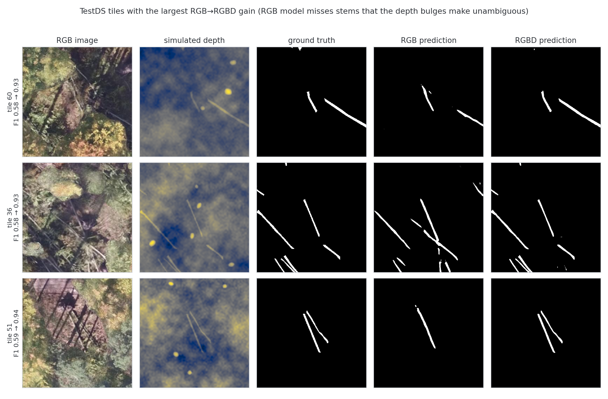
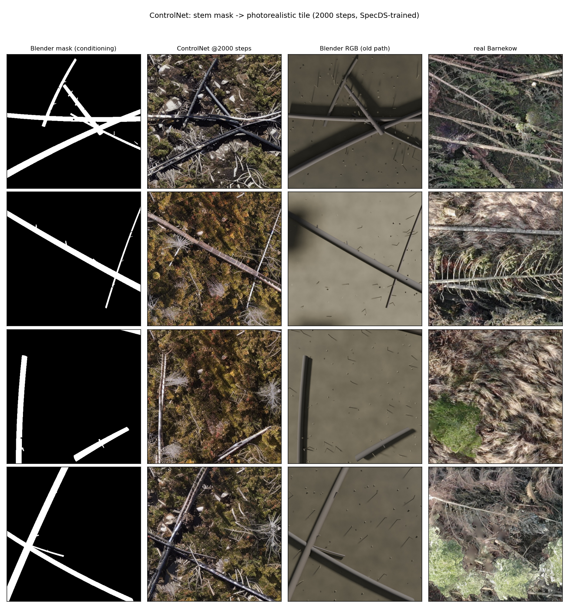

# Open pull requests — what each one does

Status 2026-08-05. **Four** PRs open against `main`, after consolidation:
#12 was merged into #15, and #17 was merged into #16 and closed.

```
main
 ├── #15  CPU speedup (~10x) + parity/latency docs   26 files   READY
 ├── #16  Synthetic data generation + RGBD input     66 files   READY
 ├── #13  BAMFORESTS benchmark + multiscale loader   17 files   draft
 └── #14  Learned stem vectorization study           37 files   draft
```

## Suggested merge order

1. **#15** — 103 tests pass. Merge **normally, not squashed**: #12's head commit is a
   true ancestor of this branch, so a regular merge lets GitHub close #12 as *merged*
   automatically. A squash rewrites that history and #12 would need closing by hand.
2. **#16** — self-contained; the RGBD contract change is backwards compatible.
3. **#13 / #14** — leave as drafts; both need their result artifacts committed.

> `training/dataset.py` is touched by both #13 (`resize=`) and #16 (`depth_dir=`). They
> fork from the same `main` commit and neither is an ancestor of the other, so whichever
> merges second needs a manual reconcile there. The parameters compose cleanly; git will
> not do it automatically.

---

## #15 — CPU-inference speedup + parity docs (ready)

*Contains #12. +1688 across 26 files. Full suite: 103 passed.*

**Two halves that belong together:** the baseline measurement and the optimization that
acts on it. The latency table reports ~2521 ms per 512² tile out of the box; the code
half brings that to ~249 ms.

**Docs.** R-vs-PyTorch parity from the two-stage `r_vs_pytorch_lrfix` run — the port is
accuracy-neutral versus R at matched 256², modestly ahead at the deployed 512² — plus a
baseline pre-optimization latency table.

**Code.** Two independent levers that keep the frozen ONNX contract: `width_mult` scaling
every channel width (1.0 byte-identical to the historical ladder, locked by a state-dict
test) and int8 quantization (static QDQ calibrated on real tiles). Also a Keras→ONNX
converter for the four upstream Zenodo flavours, latency rigs, and a release script.
Reported effect: width-0.5 + static int8 ≈ **10× faster on CPU** at unchanged F1 0.760.

**Two real bugs found in review, both of which would have shipped:**

- `width_mult` crashed for untested values — decoder blocks took input channels from the
  next ladder width rather than the actual skip+upsample concat. These coincide only at
  {1.0, 0.5, 0.25}, and the CLI accepted arbitrary floats.
- Dynamic int8 export was **unloadable**: `quantize_dynamic(QInt8)` emits `ConvInteger`
  with signed weights, which onnxruntime's CPU EP does not implement, so session load
  failed on the branch's own minimum onnxruntime. Fixed to `QUInt8`; the static path
  behind the 10× claim was unaffected.

Caveat: the speedup numbers are self-reported from one local machine (no CI here). What
*is* test-covered is contract conformance on the quantized and converted exports.

---

## #16 — Synthetic training data + RGBD input (ready)

*Contains #17, which is closed. 66 files.*

### Part 1 — Depth simulator + `--rgbd`

`scripts/simulate_depth.py` synthesizes terrain depth from existing stem masks: fractal
terrain plus cylindrical stem bulges, deliberately degraded with bulge dropout, off-mask
distractors and sensor noise so depth is a helpful-but-unreliable cue. `--mismatch`
pairs each tile with the *wrong* mask as a leakage control.

`--rgbd` makes the path 4-channel throughout: channels-parameterized ONNX contract
(`IN_CHANNELS` stays 3), `normalize_depth`, `in_channels` through the model factory and
export, a channel-inferring `OnnxSegmenter`, optional `depth_dir` in `StemDataset`, and
depth as a geometric-only augmentation target.

| arm | TestDS F1 | reading |
|---|---|---|
| RGB baseline | 0.738 | — |
| **RGBD, matched depth** | **0.892** | +0.15 |
| RGBD, mismatched depth (control) | 0.755 | ≈ RGB |

The mismatch control is what makes this credible: the gain is genuine fusion, not the
model reading the label off the fourth channel.



### Part 2 — Synthetic training data generation

A seeded `SceneSpec` yields aligned labels (binary mask, per-stem instances, amodal
instances with visibility, 16-bit height field); an SDXL **ControlNet** trained on 3,681
real SpecDS mask→tile pairs paints the photorealistic RGB.

**A segmenter trained on only generated imagery reaches F1 0.693 on real hand-labelled
TestDS — 94% of the 0.738 real training data achieves, with zero manual annotation.**



What the evidence showed (full writeup: `docs/synthetic-data-results.md`):

- **Label fidelity beats visual realism.** The most realistic generator was the worst
  teacher (F1 0.195, recall 0.112) — it painted brash over labelled stems.
- **Prompting cannot move appearance; data can.** A ControlNet trained hard on one domain
  overrides the text prompt almost entirely.
- **Instance segmentation needs a box-free method.** Mask R-CNN reached only 0.079, and
  the cause was measured: a stem fills a median **12.9%** of its axis-aligned box, so the
  mask head paints a thin diagonal inside a box that is ~87% background.
- **Measure with the right instrument.** Mask adherence was scored for several rounds
  with a judge that under-detects on this domain (0.8% vs 4.9% stem coverage on real
  imagery); re-measuring moved every number.

### Real-depth robustness

`normalize_depth` handles NaN and sentinel nodata (previously one NaN turned a whole tile
to NaN); `--depth-vmin/--depth-vmax/--depth-nodata` pin a fixed physical range, since
per-image min-max discards the absolute height that makes real depth useful; and
`scripts/validate_dataset.py` preflights a dataset — catching partial depth dirs, which
silently shrink the training set rather than erroring, and reporting the depth→mask AUC.

That AUC immediately flagged a limitation of the generated data: **0.848**, i.e. the
synthetic height field largely restates the label. Usable for RGB training; not for
judging whether depth helps.

**To finish:** scale generation past 1,200 tiles to test whether the last 0.045 to
real-data parity closes; re-run the full suite on the merged branch.

---

## #13 — BAMFORESTS benchmark + multiscale loader (draft)

Native-resolution multiscale training (rotate-then-crop), deterministic grid-tiled
evaluation, a site-held-out BAMFORESTS benchmark harness, and ONNX execution-provider
selection (CUDA → CoreML → CPU).

The dataloader and runtime code are well tested (7 multiscale tests, 5
provider-precedence tests). The *benchmark claims* are prose-only: the cited
`results/*.md` artifacts are not in the PR, and everything is single-seed.

**To un-draft:** smoke tests for the sitesplit and ablation scripts, and either include
or link the result artifacts.

---

## #14 — Learned stem vectorization (draft)

A self-contained mini-project distilling the analyzer's heuristic mask→stem-graph
vectorization (skeletonize → graph → angle-vote → diameter) into a multi-head UNet
predicting centreline / orientation / diameter fields, decoded back to polylines.

**Newly relevant:** #16's instance-segmentation result is a negative one that points
straight back here — box-based detection fails on long diagonal stems, and this branch's
field-based formulation avoids boxes entirely.

16 hermetic unit tests; quantitative claims are prose-only because the data and
checkpoints are not committed (honestly disclosed). Two `rasterio`-dependent tests are
now `importorskip`-guarded so `pytest` is green out of the box.
