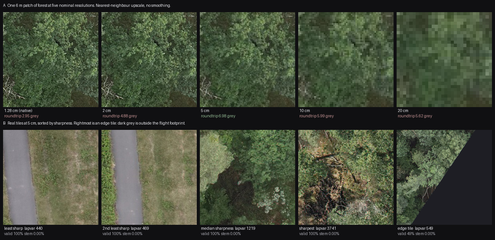

# Data inventory

Every number here was measured from the files on 2026-08-14, not transcribed from earlier
notes. Rasters read with `rasterio`, vectors with `fiona`; areas are in each layer's own
CRS units (m²). Source tree: `/Volumes/storage/Datasets/Winmol/training_data/WINMOL_Trainings_Data/GIS`
(mounted on T14 as `/data/mnt/storage/...`).

## The headline number

**1.18 ha of labelled stem exists in total** — 0.98 ha across 8 annotated sites in the main
GIS tree, plus 0.20 ha from the Tegel Revier 12/13 surveys (section 6). 31 orthomosaics are
held; **21 of them have no stem annotations at all**. Labelling, not imagery, is the binding
constraint on this project.

A further **0.033 ha (327 m²) of stem** was digitised in 2026-08 inside the Revier 13
hard-negative AOIs (section 8). It is counted separately because its purpose is the
*background* around it, not the stems themselves.

## 1. Orthomosaics — all 29

Year is the acquisition date encoded in the filename (`YYYYMMDD`).

### Beech (10 rasters)

| acquisition | site | GSD | size | CRS |
|---|---|---:|---:|---|
| 2017-10-16 | EW_WW_Campus | 6.39 cm | 147 MPx | EPSG:32633 |
| 2017-11-14 | EW_WW_Bachsee_north | 4.08 cm | 214 MPx | EPSG:32633 |
| 2017-11-23 | EW_WW_Bachsee_south | 3.95 cm | 257 MPx | EPSG:32633 |
| 2021-07-06 | EW_WW_Kaufland | **2.09 cm** | 125 MPx | EPSG:25833 |
| 2022-02-26 | EW_WW_Campus_Oberheide | 3.36 cm | **1911 MPx** | EPSG:25833 |
| 2022-02-26 | EW_WW_Campus_Oberheide (clip) | 3.36 cm | 373 MPx | EPSG:25833 |
| 2023-11-06/07 | Altmann_Jauerling (AT) | 3.30 cm | 540 MPx | EPSG:3416 |
| 2024-07-19 | FR17203_Abt-128_129_30 | 3.52 cm | 280 MPx | **none** |
| 2025-03-06 | 172_03_Kohlleiten_Meislingeramt (AT) | 3.52 cm | 280 MPx | EPSG:3416 |
| 2025-03-27 | 171_4_Kraking_Windwurf | 3.99 cm | 76 MPx | EPSG:25833 |

### Spruce (13 rasters)

| acquisition | site | GSD | size | CRS |
|---|---|---:|---:|---|
| 2022-02-09 | Bremerhagen 1–8 | 1.23 – 1.84 cm | 302 – 802 MPx | EPSG:25833 |
| 2022-02-12 | Barnekow 1, 3, 5, 6 | 1.51 – 1.76 cm | 297 – 870 MPx | EPSG:25833 |
| 2022-02-12 | Barnekow 2, 4 (**IR**) | 1.75 / 2.07 cm | 70 / 141 MPx | EPSG:25833 |
| 2022-03-09 | EW_WW_Kaltes_Wasser_2 | 1.64 cm | 815 MPx | EPSG:25833 |
| 2022-03-09 | EW_WW_Ruheforst | 1.61 cm | 796 MPx | EPSG:25833 |

### Pine (3 rasters)

| acquisition | site | GSD | size | CRS |
|---|---|---:|---:|---|
| 2022-03-09 | EW_WW_Stromtrasse | 2.75 cm | 625 MPx | EPSG:25833 |
| 2022-03-29 | Alt_Madlitz_plot123 | 2.58 cm | 603 MPx | EPSG:25833 |
| 2022-03-29 | Alt_Madlitz_plot4 | 3.24 cm | 134 MPx | EPSG:25833 |

**GSD spans 1.23 – 6.39 cm/px, a 5.2× range.** The Analyzer serves at a fixed
`tile_size / 512` (2.93 cm/px by default), so most of this corpus is nowhere near the
serving scale unless resampled — which is what `--extent`/`--tile-px` extraction does.

## 2. Stem annotations — only 8 sites carry them

Units are in the header rather than every cell, and dates are in section 1.
All layers are `EPSG:25833` **except Campus, which is 32633**.

| site | species | polygons | stem m² | AOI m² |
|---|---|---:|---:|---:|
| Campus | beech | 822 | 2,908 | 118,808 |
| Bachsee_north | beech | 136 | 451 | 31,527 |
| Kaufland | mixed | 125 | 250 | 5,393 |
| Campus_Oberheide | **mixed** | 490 | 1,917 | 111,631 |
| Bremerhagen_3 | spruce | 158 | 180 | 2,566 |
| Barnekow_3 | spruce/pine | 358 | 741 | 15,516 |
| Barnekow_5 | spruce/pine | 1,012 | 1,826 | 27,788 |
| Barnekow_6 | spruce | 741 | 1,528 | *none* |
| **total** | | **3,842** | **9,802** = 0.98 ha | |

A ninth file, `202171114_EW_WW_Bachsee_north`, is a **typo'd duplicate** of the 2017-11-14
layer — the same 136 polygons and 451 m². It has no matching orthomosaic. Ignore it; do
not "fix" the name and pair it, or those stems are counted twice.

### Species composition of the labelled polygons

| code | species | polygons |
|---|---|---:|
| GFI | Gemeine Fichte (Norway spruce) | 1,986 |
| RBU | Rotbuche (European beech) | 1,211 |
| GKI | Gemeine Kiefer (Scots pine) | 231 |
| DGL | Douglasie (Douglas fir) | 97 |
| GBI | Gemeine Birke (birch) | 10 |
| RGU | Roterle/other | 1 |
| — | no species attribute | ~295 |

**No pine site is annotated.** The 231 GKI polygons are pine stems inside the two Barnekow
spruce stands, not a pine acquisition — all three pine orthomosaics have zero labels.

**"Beech" sites are not pure beech.** Campus_Oberheide is GFI 199 / RBU 190 / DGL 92, so
the beech models in this repo are trained on a mixed stand that happens to sit in the beech
folder. Kaufland is RBU 110 / GBI 10 / DGL 5.

## 3. The four beech sites used for training

These are the sites behind every result in `scale-augmentation-results.md` and
`scale-augmentation-loso.md`.

| site | date | season | GSD | hue | saturation | notes |
|---|---|---|---:|---:|---:|---|
| Campus | 2017-10-16 | autumn | 6.39 cm | 15° | 0.19 | coarsest raster in the corpus |
| Bachsee_north | 2017-11-14 | **late autumn** | 4.08 cm | 25° | **0.73** | amber canopy; CRS mismatch vs its ortho |
| Campus_Oberheide | 2022-02-26 | leaf-off | 3.36 cm | 32° | 0.25 | 33% footprint overlap with Campus |
| Kaufland | 2021-07-06 | **high summer** | 2.09 cm | 98° | 0.32 | finest raster; smallest AOI |

Two facts that shaped the experiments:

- **Campus and Campus_Oberheide are the same forest**, imaged 4.4 years apart; 33% of
  Campus's tiles overlap a Campus_Oberheide footprint (centroids 183 m apart). They are not
  independent sites, so a "leave-one-site-out" fold on either is really a temporal holdout.
- **Bachsee_north is the only late-autumn acquisition**, at 2.4–3.8× the saturation of
  every other site. Held out it scores F1 ~0.09; trained on its own west half it reaches
  **0.62** on its east half. Removing it from training costs the other folds up to 9.5 F1.

## 4. Published datasets (Zenodo record 5682580, Reder et al.)

Verified byte-identical against the record.

| dataset | tiles | tile size | on disk | role |
|---|---:|---:|---:|---|
| GenDS10 | 4,540 | 2000×2000 | 2.3 GB | synthetic stage-1 pretraining |
| SpecDS | 454 | 313×313 | 12 MB | species-specific stage-2 |
| TestDS | 117 | 313×313 | 3.2 MB | the papers' test set |

Two caveats measured here. **GenDS10's 2000 px tiles carry roughly 500–650 px of real
information** — a round trip through 512 costs 1.45 grey levels against SpecDS's 3.73, so
they are largely interpolation; effective GSD ≈ 4.6 cm/px. And **TestDS contains 117 tiles,
not the 106 stems the 2022 paper describes**.

`GenDS10_512` (4,540 tiles, 736 MB) is our pre-resized copy: the loader's exact resize
applied once instead of every epoch, verified to reproduce the loader's array to 0.0000/255.

## 5. Datasets built in this repo

All carry `tiles.jsonl` (source ortho, world centre, rotation, GSD, stem fraction), which
is what makes any tile traceable back to the ground via `locate_tile.py` (private helper
repo).

| dataset | tiles | tile px | extent | GSD | purpose |
|---|---:|---:|---:|---:|---|
| BeechScale666 | 3,388 / 400 / 400 | 666 | 19.512 m | 2.9297 cm | scale-augmentation arms |
| loso/site_all/Campus | 800 | 666 | 19.512 m | 2.9297 cm | LOSO fold source |
| loso/site_all/Campus_Oberheide | 800 | 666 | " | " | " |
| loso/site_all/Bachsee_north | 800 | 666 | " | " | " |
| loso/site_all/Kaufland | **388** | 666 | " | " | " |
| loso/site_tv/{Campus,Oberheide} | 1,600 + 300 each | 666 | " | " | block train/val |

Kaufland yields only 388 tiles because its AOI is 5,393 m² and a 19.512 m footprint holds
13.80 m in from every edge.

## 6. Tegel Revier 12 / 13 — added 2025-07, measured 2026-08-16

Two surveys held separately from the GIS tree above, digitised as five sample plots.
Detail and results in [`tegel-r12-r13-results.md`](tegel-r12-r13-results.md).

| ortho | acquisition | GSD | size | CRS | bands |
|---|---|---:|---:|---|---|
| Revier 12 `result_Res1.2_webp.tif` | 2025-07 | **1.20 cm** | 339k × 334k px, 12 GB | EPSG:32633 | RGBA |
| Revier 13 `result_Res1.3_COG.tif` | 2025-07 | **1.28 cm** | 393k × 335k px, 19 GB | EPSG:32633 | RGB |

| plot | polygons | stem area | AOI |
|---|---:|---:|---:|
| R12-P1 | 178 | 215 m² | 14,913 m² |
| R12-P2 | 552 | 891 m² | 23,080 m² |
| R12-P3 | 299 | 501 m² | 8,692 m² |
| R13-P1 | 232 | 248 m² | 8,865 m² |
| R13-P2 | 123 | 141 m² | 13,436 m² |
| **total** | **1,384** | **1,996 m² = 0.20 ha** | |

**This raises the corpus from 0.98 ha to 1.18 ha of labelled stem, +20%**, and adds the
first substantial pine (153 polygons), birch (120) and ash (41) annotations. Labels are
`EPSG:25833` against `EPSG:32633` orthos; registration verified at zero offset on all
plots. Species names are free text with the same variant problem as the older corpus
(`POPLAR` / `WHITE POPLAR` / `SILVER POPLAR`).

## 7. Defects to handle

- **Mixed CRS.** Campus and Bachsee north/south orthos are EPSG:32633; everything else is
  EPSG:25833 — the same UTM zone on different datums, so a silent mismatch shifts masks by
  metres rather than failing. `20171114_EW_WW_Bachsee_north` has annotations in 25833 and
  its ortho in 32633. Both scripts reproject explicitly, and this was **verified**: every
  beech site's polygons peak at zero offset on its own raster grid
  (`check_registration.py`, private helper repo), residual under 4 cm.
- **One orthomosaic has no CRS at all** (`20240719_FR17203_Abt-128_129_30.tif`). It is
  unannotated, so nothing depends on it yet.
- **`202171114_EW_WW_Bachsee_north`** — typo'd duplicate, see above.
- **Species case variants**: `RBU`/`rBU`/`RBu`, `GFI`/`GFi`/`gFI`, `DGL`/`DGl`/`dGL`, plus
  single-record typos `GIF` and `GFIU`. Match case-insensitively or silently drop records.
  ~295 polygons carry no species at all.
- **No DEM/DSM/CHM anywhere** in the corpus — height is not available as a channel.
- **Two Barnekow rasters are infrared** (2 and 4), not RGB; they are unannotated.
- **`gends10_ready`** is a locally derived copy that is not trusted; use the Zenodo
  originals.

## 8. Tegel Revier 13 hard negatives — labelled 2026-08, measured 2026-08-20

A deliberate **hard-negative** set: ground that looks like stems and is not — paths, slash,
deadwood, shadow — digitised inside three numbered AOIs on the Revier 13 orthomosaic, with
the genuine stems in them marked so the negatives are not accidentally positive.

`WINDWURF_Tegel/Revier_13/cw_hard_negatives.gpkg`

| layer | features | geometry | CRS | role |
|---|---:|---|---|---|
| `hard_negative_AOI` | 166 | Polygon | **EPSG:4326** | the **stems** — the layer name describes the collection's purpose, not its content |
| `AOI` | 3 | Polygon | EPSG:32633 | the leakage groups; no attributes, so `fid` order is the only identifier |
| `trees_1` | 0 | Polygon | — | empty |

Stem attributes: `stem_id` (int — ties the masks of one occluded stem together, 9 stems are
split across more than one polygon), `old_tree` (bool, 35 of 166), `comment` (free text, 22
populated). **`species` is absent**; an earlier read of this file had it as `Integer`, so the
column was dropped during labelling. Anything consuming it must tolerate its absence.

### Per-AOI content

| AOI `fid` | area | stems | stem area | stem fraction | bbox | bbox fill |
|---:|---:|---:|---:|---:|---|---:|
| 1 | 25,471 m² | 48 | 105.0 m² | 0.41% | 231 × 297 m | 36% |
| 2 | 126,547 m² | 107 | 217.1 m² | 0.17% | 634 × 530 m | 37% |
| 3 | 2,152 m² | 3 | 4.8 m² | 0.22% | 90 × 40 m | 58% |
| **total** | **154,170 m² = 15.4 ha** | **158** | **327 m²** | **0.212%** | | |

Eight of the 166 stems fall outside AOI 1–3 and are out of scope. Mean stem polygon is
2.2 m² — these are small, and 0.212% is two orders of magnitude below the 0.5%
`--min-stem-frac` floor `geo/sample.py` applies to make SpecDS stem-dense. **That inversion
is the point**: rejecting empty tiles is exactly wrong for a hard-negative set.

Measured against the resampled rasters, stem cover is 0.21% of *valid* (in-footprint) area
and holds to ±0.002 pp from 2 cm through 20 cm.

### Registration and defects

- **The stems are EPSG:4326 while the AOIs and the orthomosaic are EPSG:32633.** A spatial
  join across them returns **zero rows and raises nothing** — the same class of silent
  mismatch as §7, and how this was found. Reprojection puts all 166 back on the AOIs with
  **zero invalid rings** (no `make_valid` repairs needed), so the digitising is clean.
- The AOIs are irregular: they fill only 36–58% of their own bounding boxes, and they are
  far apart — a single bounding box over all three spans 1,914 × 2,280 m, **10× the pixels
  of three separate crops**.
- The file is written with SQLite WAL journalling. A `-wal` sidecar was present and growing
  during measurement, so counts taken while QGIS holds it open can move; the numbers above
  were read through GDAL, which honours the WAL.

### Footprint

Only **58.2%** of AOI 3's bounding box is inside the flight footprint. The orthomosaic
carries a per-dataset internal mask band, which is the footprint; it is preserved through
cropping and resampling (58.22% at 1.28 cm → 58.38% at 20 cm) and is what `--min-valid-frac`
reads. Thresholding dark pixels instead would also reject genuine shadow.

### Derived rasters and the training set

Built with the staged pipeline (`--ingest`, `--clip-aoi`, `--resample`, `--rasterize`,
`--layout`, `--cut`, `--from-folder`; design in the helper repo's
`docs/superpowers/specs/2026-08-20-training-data-pipeline-design.md`), clipped per AOI:

| AOI | clip @ 1.28 cm | in-footprint | 5 cm |
|---:|---|---:|---|
| 1 | 18,089 x 23,244 | 34% | 4,630 x 5,950 |
| 2 | 49,561 x 41,426 | **23%** | 12,687 x 10,605 |
| 3 | 7,073 x 3,193 | 48% | 1,810 x 817 |

Clipping to the AOIs cuts the work from the full ortho's 131.6 Gpx to about 2.5 Gpx, a
factor of 53, which is what makes a multi-GSD sweep a minutes-long job.

`_tmp/r13_hardneg_multiscale` — **2,459 tiles, 926 MB**, five ground extents at 5 cm:

| extent | tiles | px | stem-bearing |
|---:|---:|---:|---:|
| 10 m | 1,187 | 200 | 155 |
| 15 m | 558 | 300 | 105 |
| 20 m | 334 | 400 | 91 |
| 25 m | 218 | 500 | 67 |
| 30 m | 162 | 600 | 60 |

19% carry stem, 20% straddle an AOI boundary, and exactly 10 fully-empty tiles are kept
out of the 827 the cut produced. Note the 10 m arm is 48% of the dataset but only 32% of
the stem-bearing tiles — small tiles fragment stems and many land between them, so weight
by extent rather than tile count when mixing this with a positive corpus.

## 9. What the Revier 13 imagery is actually like

Two measured findings, neither of them "the images are blurry".

### The 1.28 cm GSD is nominal, not effective

Panel A is one 6 m patch of forest at five resolutions, upscaled nearest-neighbour so
nothing is smoothed. **1.28 cm and 2 cm are visually indistinguishable.** The round-trip
metric of §4 — mean grey levels lost to a 2x down/up cycle, high meaning real detail —
puts numbers on it, measured on the same ground patch:

| level | 1.28 cm | 2 cm | 5 cm | 10 cm | 20 cm |
|---|---:|---:|---:|---:|---:|
| round-trip Δgrey | **2.95** | 4.88 | **6.98** | 5.99 | 5.62 |

The metric **peaks at 5 cm**, not at native. Native pixels carry *less* independent
information each than their own 5 cm downsample, which is the signature of an oversampled
raster: the photogrammetry emitted a finer grid than the optics support. Measured the same
way, SpecDS and TestDS score 2.77 and GenDS10 scores 1.25, so Revier 13 at native sits
barely above the published 313 px tiles despite a nominally 4x finer GSD.

**Effective resolution is therefore ~5 cm, and cutting tiles at 1.28 cm buys 15x the
pixels and no more information** — the GenDS10 failure of §4 repeated on new imagery.

### Sharpness varies by ground cover, not by image quality

Panel B ranks real tiles by Laplacian variance. The least sharp are **asphalt roads**
(lapvar 440-469): smooth surfaces genuinely have little texture. The sharpest is slash and
deadwood (3,741). Across 1,346 fully-valid tiles the range is 440-3,741 with no blurred or
mis-stitched examples, so tile-to-tile variation is scene content and not a defect to
filter on.

### The real defect is missing imagery

The rightmost tile in panel B is 49% valid: a clean diagonal where the flight footprint
ends. **Only 23% of AOI 2's bounding box is inside the footprint at all**, and an
unfiltered edge-tile run produced 25% fully-black tiles. The orthomosaic marks these
correctly in its per-dataset mask band, but that mask is easy to lose — a `gdalwarp
-dstalpha` crop silently discards it and reports every black pixel as valid data. Anything
cropping this ortho must carry the mask explicitly and check it afterwards.
