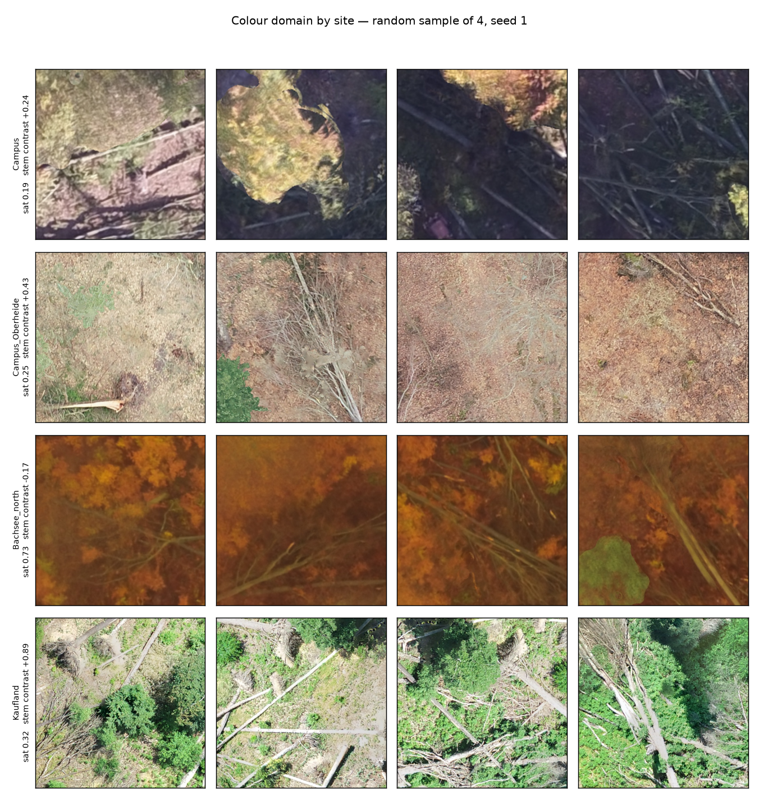
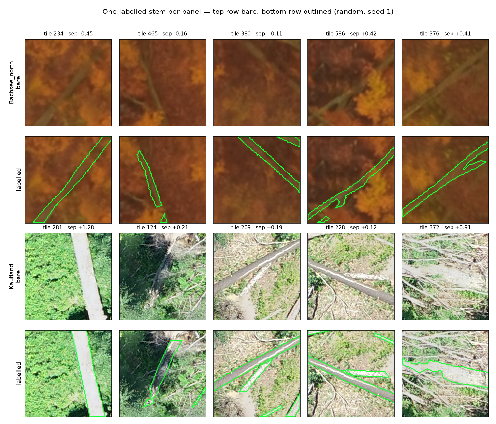
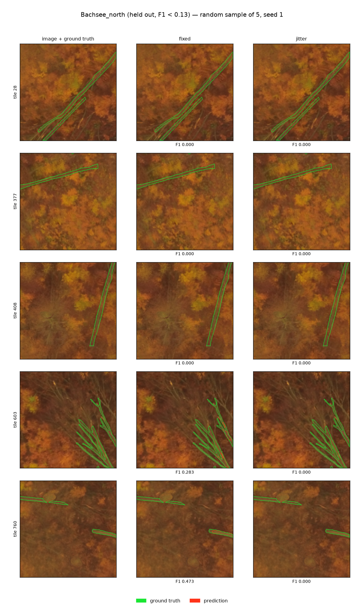
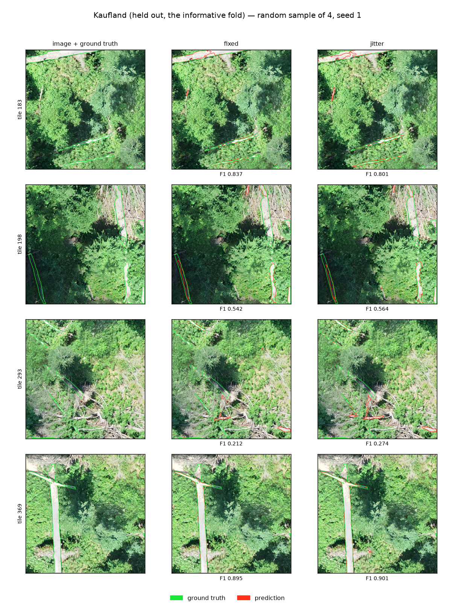
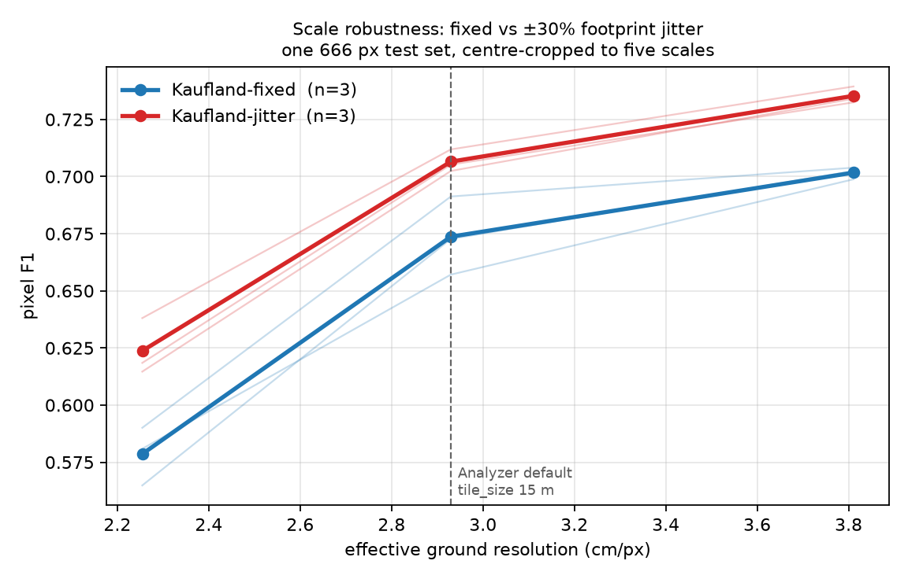
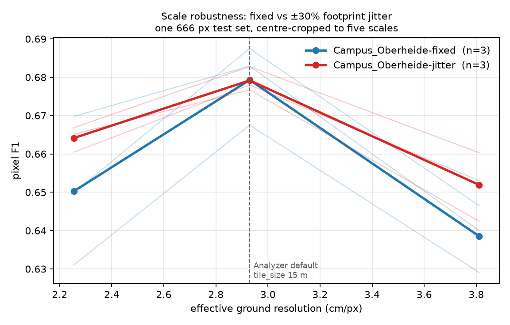
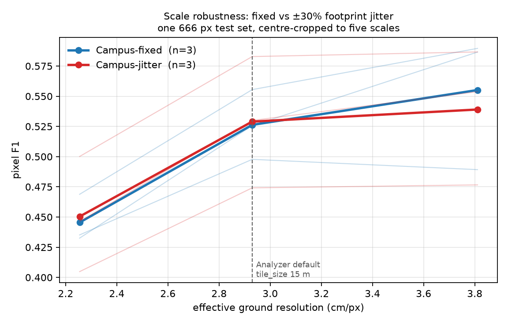
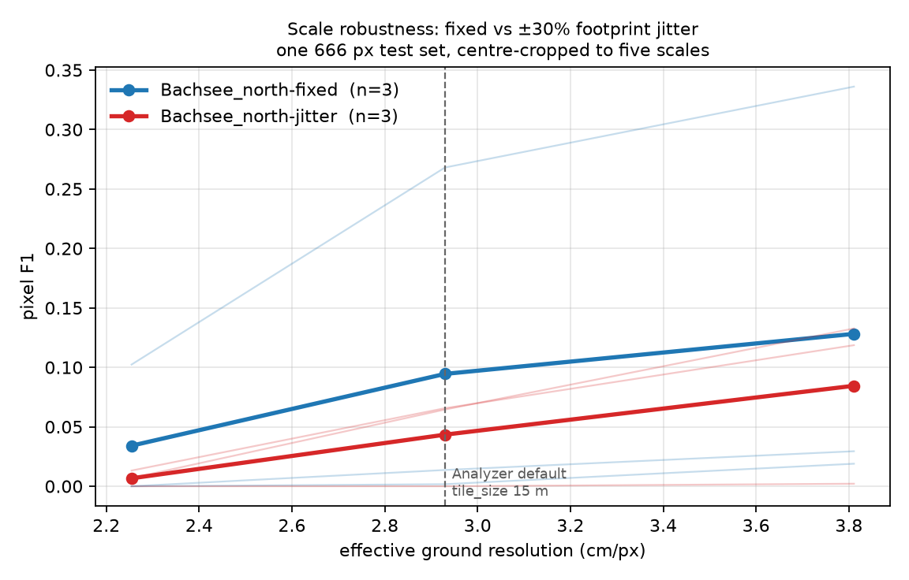

# Scale jitter under a site holdout — four folds, reported individually

Follow-up to [`scale-augmentation-results.md`](scale-augmentation-results.md), which
measured scale jitter on splits that **share sites**. This asks whether the robustness
survives when the test site is absent from training. UNet, 3 paired seeds per arm per
fold, 24 runs. Numbers copied verbatim from [`assets/loso-*.json`](assets).

**Answer: it survives, but the evidence is thinner than the within-site result and one
fold is uninformative.** Jitter's scale curve is flatter in **4 of 4 folds**; only one
fold reaches the usual significance bar on its own.

## Two of these folds are not site holdouts

`tiles.jsonl` says **33% of Campus tiles overlap a Campus_Oberheide footprint** (centroids
183 m apart). They are the same forest imaged 2017-10-16 and 2022-02-26, and windthrown
stems do not move between acquisitions — so those are largely the same physical stems.

| fold | test tiles | nearest training site | what it measures |
|---|---:|---:|---|
| **Bachsee_north** | 800 | **5.68 km** | new-site transfer |
| **Kaufland** | 388 | **3.56 km** | new-site transfer |
| Campus | 800 | 0 m (33% overlap) | 4.4-year acquisition gap |
| Campus_Oberheide | 800 | 0 m (30% overlap) | 4.4-year acquisition gap |

Reported under those two headings, never pooled.

## Every fold, no mean

`spread` = each seed's peak-minus-worst F1 across 0.77× / 1.00× / 1.30×. Lower is more
scale-robust; the paired column counts seeds where jitter is flatter.

| fold | F1@1.00× fixed | jitter | spread fixed | spread jitter | flatter | t |
|---|---:|---:|---:|---:|:--:|---:|
| Bachsee_north | 0.0945 | 0.0434 | 0.0940 | 0.0778 | 1/3 | −0.15 |
| Kaufland | 0.6737 | **0.7065** | 0.1231 | 0.1116 | 2/3 | −1.31 |
| Campus | 0.5263 | 0.5290 | 0.1125 | 0.0886 | 2/3 | −1.41 |
| Campus_Oberheide | 0.6793 | 0.6792 | 0.0408 | **0.0272** | 3/3 | −5.52 |

**Direction is unanimous — all four mean spreads favour jitter — but only
Campus_Oberheide clears |t| ≥ 3 with unanimous seeds.** State this as a fold count, not a
mean: *flatter in 4/4 folds, individually significant in 1/4.*

### Bachsee_north is a domain-shift fold, not a defective one

F1 **0.03–0.13** for every arm and seed. Three explanations were tried; the first two are
wrong and are recorded here because each looked convincing.

**Not a labelling error.** Its annotations are EPSG:25833 and its orthomosaic EPSG:32633 —
the same UTM zone on different datums, a pair that has diverged ~0.5 m through plate
motion, and already logged as a known defect. Measured with
`scripts/check_registration.py` on the orthomosaic's **own unrotated grid**, every beech
site peaks at zero offset:

| site | stems / ortho CRS | contrast at zero | bright peak | verdict |
|---|---|---:|---|---|
| Bachsee_north | 25833 / 32633 **mismatch** | +0.118 | (0.00, 0.00) m | registered |
| Campus | 32633 / 32633 | +0.384 | (0.00, 0.00) m | registered |
| Campus_Oberheide | 25833 / 25833 | +0.811 | (0.00, 0.00) m | registered |
| Kaufland | 25833 / 25833 | +0.797 | (0.00, 0.02) m | registered |

The pipeline's `transform_geom` applies the datum shift; residual under 4 cm.

**Not invisible stems either — this was my error.** The table above measures *luminance*,
and on that basis Bachsee looked like a closed canopy hiding its stems. It is not. Its
stems differ from the background in **colour**, not brightness. In CIELAB over 100 random
tiles per site:

| site | luminance sep | chroma sep | **full Lab sep** | fold F1 |
|---|---:|---:|---:|---:|
| Kaufland | 0.77 | 1.98 | **2.14** | 0.71 |
| **Bachsee_north** | 0.44 | 1.66 | **1.75** | **0.09** |
| Campus_Oberheide | 0.56 | 1.51 | 1.70 | 0.68 |
| Campus | 0.53 | 0.95 | **1.16** | 0.53 |

Bachsee has the **second-strongest** stem/background separation in the corpus. Campus has
the weakest and scores 0.53. An earlier claim in this repo that fold F1 is monotone in
stem contrast came from the luminance-only statistic and is **withdrawn**.

The close-ups make it plain — pale olive stems against orange canopy, labels sitting on
them:

**It is domain shift, and one training run proves it.** Trained on 252 tiles from the west
half of Bachsee and tested on the spatially separated east half (30.3 m closest approach
against the 27.59 m floor):

| training data | test | F1 | precision | recall |
|---|---|---:|---:|---:|
| 3,588 tiles, other sites (the LOSO fold) | Bachsee | **0.09** | — | — |
| **252 tiles, Bachsee's own west half** | Bachsee east | **0.6203** | 0.6061 | 0.6351 |

252 of its own tiles beat 3,588 of everyone else's by 53 F1 points. The signal is there,
the labels are on it, and the site is learnable. It fails as a holdout because it is the
corpus's **only autumn-phenology site**: held out, nothing in training has ever shown the
model a stem against orange foliage.

Green is ground truth, red is prediction; on most tiles there is no red at all — recall
collapse in its extreme form. The fold remains a **tie** for arm comparison, but for a
different reason than "hard data": both arms are equally outside their training domain.

#### Strong hue augmentation fixes it — +64.6 F1

If Bachsee fails only because no training site is amber, randomising hue should remove the
colour shortcut and force the model onto structure. Tested: 12 UNet runs, 3 paired seeds,
arms differing **only** in `HueSaturationValue` limits, both re-run so nothing is inherited.

| arm | hue | sat | val | p |
|---|---:|---:|---:|---:|
| base | ±20 | ±30 | ±20 | 0.5 |
| **strong** | **±90** (any hue) | ±60 | ±30 | 0.9 |

| fold | base | strong | delta | signs |
|---|---:|---:|---:|:--:|
| **Bachsee_north** (out of domain) | 0.042 | **0.688** | **+0.646** | 3/3 |
| Kaufland (in domain) | 0.708 | 0.690 | −0.017 | 0/3 |

Per seed on Bachsee: 0.0000 / 0.0639 / 0.0619 → 0.6660 / 0.7059 / 0.6916.

**The failure mode inverts.** The base arm's precision is 0.87–1.00 with **recall
0.00–0.03** — it predicts essentially nothing. Strong moves recall to 0.58–0.66 at
precision 0.76–0.79. Note 0.688 also exceeds the 0.62 that training on Bachsee's *own*
west half achieved, so the other three sites do contain the information; the model simply
could not reach it through the colour gap.

**Cost:** −1.7 F1 in domain (3/3 seeds, |t| 1.6). That is a real cost and small enough to
be worth paying for anything expected to meet a new acquisition or season.

**This retires the standing advice** that a site holdout is impossible on this corpus.
It is not; it needs strong colour augmentation. Untested: whether a milder setting (hue 45)
keeps the gain without the in-domain cost, and whether this transfers to spruce and pine. Failing that, this site should never be the held-out one.

### Kaufland is the informative clean holdout

The only true spatial holdout where the model works at all, and jitter wins **at every
scale on every seed**:

| ratio | GSD | fixed | jitter | diff | sign | t |
|---:|---:|---:|---:|---:|:--:|---:|
| 0.77× | 2.254 | 0.5786 | 0.6237 | **+0.0451** | 3/3 | 4.37 |
| 1.00× | 2.930 | 0.6737 | 0.7065 | **+0.0328** | 3/3 | 2.61 |
| 1.30× | 3.811 | 0.7017 | 0.7353 | **+0.0336** | 3/3 | 9.58 |

Here jitter is worth **+3.3 F1 at the deployment scale** — an order of magnitude more than
the +0.2 measured within-site. Note the curve *rises* with coarseness on this fold, unlike
every other: Kaufland is the corpus's finest orthomosaic (2.09 cm/px native) and its
densest (stem fraction 0.063 against 0.028–0.038), so its peak sits outside the sampled
range. Its spread is therefore a lower bound.

## The curves

Per fold, F1 against effective ground resolution, per-seed spread drawn rather than
summarised. Note the y-scales differ by an order of magnitude between folds.

| | |
|---|---|
|  |  |
|  |  |

## Does Bachsee_north belong in training? Yes — tested

Before it was understood as domain shift, Bachsee looked like 800 tiles of unlearnable
noise sitting in ~20–29% of every training set. So the folds were re-run with Bachsee
**excluded from training entirely** (3 folds x 2 arms x 3 seeds = 18 UNet runs, everything
else identical). Paired within fold, arm and seed, at 1.00x:

| fold (acquisition) | train tiles | F1 with Bachsee | without | delta | signs |
|---|---:|---:|---:|---:|:--:|
| Kaufland (Jul, summer green) | 4000 -> 3200 | 0.6901 | 0.6953 | **+0.005** | 5/6 |
| Campus_Oberheide (Feb, leaf-off) | 2788 -> 1988 | 0.6793 | 0.6338 | **-0.045** | 0/6 |
| Campus (Oct, autumn) | 2788 -> 1988 | 0.5277 | 0.4324 | **-0.095** | 0/6 |

Overall **-0.045 F1**, 5 of 18 paired comparisons positive. **Removing Bachsee hurts.**

**Declared confound:** dropping the site also drops 800 training tiles, so Campus and
Campus_Oberheide lose 29% of their data and Kaufland 20%. Quantity alone would predict the
direction. It does not predict the *ordering*: Campus and Campus_Oberheide lose the
**identical** 800 tiles from identical 2788-tile sets, yet Campus loses twice as much F1.
What separates them is phenological distance from Bachsee's November amber — Campus was
flown in October, Campus_Oberheide in leaf-off February, Kaufland in high summer, and the
damage falls in exactly that order.

So the out-of-domain site is not noise to be removed; it is the nearest thing the corpus
has to phenological diversity, and the sites that resemble it depend on it most. In a
corpus with under 1 ha of labelled stem, discarding an acquisition is expensive.

The arm comparison is unaffected in direction: jitter's curve stays flatter in 3/3 folds
without Bachsee (-0.0142, -0.0450, -0.0012), though at 1.00x it now loses on the two
Campus folds and wins only on Kaufland — consistent with those folds simply having less
data to work with.

## What the holdout costs

| | within-site (pooled blocks) | site holdout |
|---|---:|---:|
| F1 @ 1.00× | 0.78 | 0.04 – 0.71 |

Between 7 and 74 F1 points, depending entirely on which site. Any single-fold number here
would have been arbitrary — which is the argument for reporting all four.

## Caveats

- **n = 3 seeds per arm per fold.** Under domain shift the within-arm seed spread reaches
  **12 F1 points** (Campus fold), against 1–2 within-site. Absolute F1 differences below
  ~3 points are unreadable at this n; the spread statistic is within-model and survives
  better, which is why the claim rests on it.
- **Only 2 of 4 folds are true spatial holdouts**, and one of those is dead. The
  new-site evidence is effectively **one fold** — strong, but one.
- **Train sizes differ by fold** (2788–4000 tiles), inherent to leave-one-site-out.
- **Val comes from one site** in the Campus and Campus_Oberheide folds, since only those
  two sites are large enough to block-split at a 19.512 m footprint.
- **Corpus limit.** Four beech sites, two of them the same ground. A stronger claim needs
  annotated sites this corpus does not have — see [[winmol-label-scarcity]].

## Verdict

The within-site recommendation stands and is mildly strengthened: jitter never hurt in any
fold, flattened the curve in all four, and on the one clean holdout where segmentation
works at all it was worth +3.3 F1 at the deployment scale. But calling this "validated
across sites" would overstate a corpus with one informative holdout fold.
