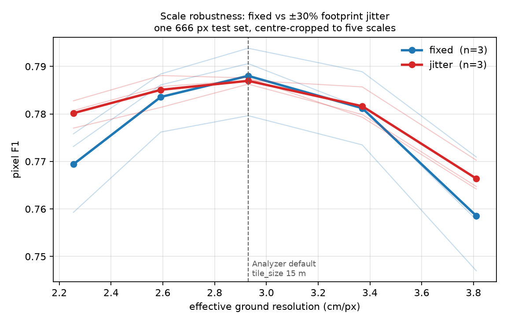

# Scale augmentation: ±30% footprint jitter buys robustness for free

Design and yardstick were fixed before training —
[`superpowers/specs/2026-08-13-scale-augmentation-design.md`](superpowers/specs/2026-08-13-scale-augmentation-design.md).
Numbers below are copied verbatim from
[`results/scale-sweep.json`](results/scale-sweep.json), rendered by
`scripts/plot_scale_sweep.py` from the six per-model sweeps in `results/scale-aug/`.

**Answer: ship it.** Jitter flattens the scale curve by **0.87 F1** (3/3 seeds, paired
t −6.02) and costs **0.11 F1** at the native scale — a difference that is 1/3 seeds
positive, i.e. indistinguishable from noise.

## Setup

| | |
|---|---|
| data | `BeechScale666` — 3388 / 400 / 400 tiles at 666 px, 19.512 m, **2.9297 cm/px** |
| sites | Campus + Oberheide block-split (60 m); Bachsee_north, Kaufland whole-to-train |
| leak check | closest train↔val↔test approach **28.3 m** / **27.9 m** vs a **27.59 m** floor |
| arms | crop 512–512 (*fixed*) vs 394–666 (*jitter*), `RandomSizedCrop`→512 |
| held fixed | same tiles, rotation/flip/photometric, HRNet, batch 16, `--deterministic` |
| n | 3 paired seeds; test = 400 tiles, CPU EP, threshold 0.5 |

Both arms train on **the same 666 px source tiles** and both get random crop *position* —
only the scale distribution differs. That is what makes the comparison clean.

## Per-scale result

Differences are jitter − fixed, paired within seed.

| crop | ratio | GSD | fixed | jitter | diff | sign | t |
|---:|---:|---:|---:|---:|---:|:--:|---:|
| 394 | 0.77× | 2.254 | 0.7694 | 0.7802 | **+0.0108** | 3/3 | 2.87 |
| 453 | 0.88× | 2.592 | 0.7836 | 0.7851 | +0.0015 | 2/3 | 0.66 |
| **512** | **1.00×** | **2.930** | 0.7880 | 0.7870 | −0.0011 | 1/3 | −0.26 |
| 589 | 1.15× | 3.370 | 0.7812 | 0.7816 | +0.0004 | 1/3 | 0.14 |
| 666 | 1.30× | 3.811 | 0.7586 | 0.7664 | **+0.0078** | 2/3 | 1.46 |

Drop from each arm's own peak — the robustness claim, independent of absolute level:

| arm | s1 | s2 | s3 | mean |
|---|---:|---:|---:|---:|
| fixed | 0.0229 | 0.0326 | 0.0328 | **0.0295** |
| jitter | 0.0168 | 0.0215 | 0.0239 | **0.0207** |

Paired: **−0.0087, 3/3 seeds flatter, t −6.02.**

## Reading it

**The win is at the flanks and it is a recall win.** At 1.30× the fixed arm's precision
*rises* to 0.819–0.829 while recall falls to 0.680–0.728: coarser pixels make stems
thinner, the model stops committing, and it under-segments. This is the benign failure
mode — an under-reporting model, invisible in F1 alone. Jitter holds recall 3–6 points
higher there at some precision cost. Every domain-shift failure measured in this project
has had this same shape.

**The per-scale t-values are weak; the spread test is not.** With n=3, only the 0.77×
point approaches significance on its own. But the spread statistic uses each seed's whole
curve rather than one point of it, and it is unanimous with |t| = 6.0. The per-scale rows
are best read as *where* the effect lives, not as five independent tests.

**The cost at native scale is nil.** −0.0011 F1, 1/3 seeds positive. The worry going in —
that spreading training over 2.25–3.81 cm/px would blunt the model at the one resolution
it is actually served at — did not materialise. Note also that validation ran at 1.00×
(`--eval-tiling`), which structurally favours the fixed arm, so this is if anything
generous to the baseline.

## Caveats, stated

- **F1 is not comparable across scales.** A 23 cm stem is 10.2 px at 2.25 cm/px and 6.0 px
  at 3.81. The downward slope on the right of the figure is partly the task getting harder,
  not the models getting worse. Only the arm-vs-arm gap within a column is readable.
- **Arm B occasionally sees the full 666 px tile; arm A never does.** A wider crop range
  means a wider field of view. This is inherent to the manipulation and cannot be
  separated from scale jitter without also changing the footprint.
- **This is not the earlier "5.2 F1 across ±30% zoom" figure.** That came from a different
  model and a test built by re-sampling the orthomosaic per scale, which put each scale on
  different ground. The 2.95 F1 measured here is the clean version of the same quantity
  and supersedes it; the two are not directly comparable.
- **Sites are shared across splits.** The claim is scale robustness within known forests,
  not transfer to a new site.
- **n = 3.** Enough for the unanimous spread result, thin for the per-scale rows.

## Recommendation

Enable `--multiscale --crop-min-px 394 --crop-max-px 666` by default for beech training.
It costs nothing at `tile_size = 15` and roughly a third of the degradation when a user
moves the tile-size spinbox, which they do. The next question worth answering is whether
a **wider** range than ±30% keeps paying — the corpus spans 1.58–6.39 cm/px, a 4× range,
far beyond what was tested here.
