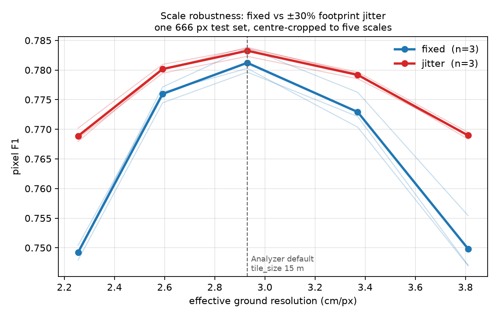

# Scale augmentation: ±30% footprint jitter buys robustness for free

Design and yardstick were fixed before training — pre-registered in
`specs/2026-08-13-scale-augmentation-design.md`, which now lives in the private helper
repo alongside the tooling below.
Numbers below are copied verbatim from
[`assets/scale-sweep.json`](assets/scale-sweep.json), rendered by
`plot_scale_sweep.py` (private helper repo) from the six per-model sweeps in
`assets/scale-aug/`. The sweeps themselves were cut by `scale_sweep.py`, same repo.

**Answer: ship it.** Measured on two architectures. On HRNet, jitter flattens the scale
curve by **0.87 F1** (3/3 seeds, paired t −6.02) and costs **0.11 F1** at the native scale
— 1/3 seeds positive, i.e. noise. On UNet the same manipulation flattens it by **1.88 F1**
(3/3 seeds, t −56.95) and *gains* 0.20 F1 at native scale as well. It wins at every scale
on every UNet seed.

Sections below cover HRNet first, then the UNet replication and a reproducibility check.

## Setup

| | |
|---|---|
| data | `BeechScale666` — 3388 / 400 / 400 tiles at 666 px, 19.512 m, **2.9297 cm/px** |
| sites | Campus + Oberheide block-split (60 m); Bachsee_north, Kaufland whole-to-train |
| leak check | closest train↔val↔test approach **28.3 m** / **27.9 m** vs a **27.59 m** floor |
| arms | crop 512–512 (*fixed*) vs 394–666 (*jitter*), `RandomSizedCrop`→512 |
| held fixed | same tiles, rotation/flip/photometric, arch, batch 16, `--deterministic` |
| n | 3 paired seeds per arch (HRNet, UNet); test = 400 tiles, CPU EP, threshold 0.5 |

Both arms train on **the same 666 px source tiles** and both get random crop *position* —
only the scale distribution differs. That is what makes the comparison clean.

## HRNet: per-scale result

Differences are jitter − fixed, paired within seed.

| crop | ratio | GSD | fixed | jitter | diff | sign | t |
|---:|---:|---:|---:|---:|---:|:--:|---:|
| 394 | 0.77× | 2.254 | 0.7694 | 0.7802 | **+0.0108** | 3/3 | 2.87 |
| 453 | 0.88× | 2.592 | 0.7836 | 0.7851 | +0.0015 | 2/3 | 0.66 |
| **512** | **1.00×** | **2.930** | 0.7880 | 0.7870 | −0.0011 | 1/3 | −0.26 |
| 589 | 1.15× | 3.370 | 0.7812 | 0.7816 | +0.0004 | 1/3 | 0.14 |
| 666 | 1.30× | 3.811 | 0.7586 | 0.7664 | **+0.0078** | 2/3 | 1.46 |

Drop from each arm's own peak — the robustness claim, independent of absolute level:

| arm | s1 | s2 | s3 | mean |
|---|---:|---:|---:|---:|
| fixed | 0.0229 | 0.0326 | 0.0328 | **0.0295** |
| jitter | 0.0168 | 0.0215 | 0.0239 | **0.0207** |

Paired: **−0.0087, 3/3 seeds flatter, t −6.02.**

## Reading it

**The win is at the flanks and it is a recall win.** At 1.30× the fixed arm's precision
*rises* to 0.819–0.829 while recall falls to 0.680–0.728: coarser pixels make stems
thinner, the model stops committing, and it under-segments. This is the benign failure
mode — an under-reporting model, invisible in F1 alone. Jitter holds recall 3–6 points
higher there at some precision cost. Every domain-shift failure measured in this project
has had this same shape.

**The per-scale t-values are weak; the spread test is not.** With n=3, only the 0.77×
point approaches significance on its own. But the spread statistic uses each seed's whole
curve rather than one point of it, and it is unanimous with |t| = 6.0. The per-scale rows
are best read as *where* the effect lives, not as five independent tests.

**The cost at native scale is nil.** −0.0011 F1, 1/3 seeds positive. The worry going in —
that spreading training over 2.25–3.81 cm/px would blunt the model at the one resolution
it is actually served at — did not materialise. Note also that validation ran at 1.00×
(`--eval-tiling`), which structurally favours the fixed arm, so this is if anything
generous to the baseline.

## Replication on UNet — the effect is real and larger

Repeated identically with `--arch unet` (same dataset, crop ranges, seeds, everything);
sweeps in [`assets/scale-aug-unet/`](assets/scale-aug-unet), aggregate in
[`assets/scale-sweep-unet.json`](assets/scale-sweep-unet.json).

| crop | ratio | GSD | fixed | jitter | diff | sign | t |
|---:|---:|---:|---:|---:|---:|:--:|---:|
| 394 | 0.77× | 2.254 | 0.7492 | 0.7689 | **+0.0197** | 3/3 | 14.97 |
| 453 | 0.88× | 2.592 | 0.7760 | 0.7802 | +0.0042 | 3/3 | 3.67 |
| **512** | **1.00×** | **2.930** | 0.7812 | 0.7833 | +0.0020 | 3/3 | 1.82 |
| 589 | 1.15× | 3.370 | 0.7729 | 0.7792 | +0.0063 | 3/3 | 3.97 |
| 666 | 1.30× | 3.811 | 0.7498 | 0.7690 | **+0.0191** | 3/3 | 6.13 |

Spread: fixed **0.0334** (0.0344/0.0333/0.0326) vs jitter **0.0146** (0.0159/0.0138/0.0142).
Paired: **−0.0188, 3/3 seeds flatter, t −56.95.**

Jitter wins at **every** scale on **every** seed, and unlike HRNet it does not even cost
anything at 1.00× — it gains 0.20 F1 there, 3/3 seeds.

**Why UNet gains more.** HRNet carries parallel branches at several resolutions through
the whole network and fuses them repeatedly, so multi-scale context is architectural. A
plain UNet has one resolution ladder and must *learn* scale invariance from the data. That
predicts exactly what is measured: UNet is the more scale-brittle baseline (spread 0.0334
vs HRNet's 0.0295) and gains the most from jitter (−0.0188 vs −0.0087). The two results
agree in direction and differ in magnitude in the direction the architectures predict,
which is a stronger joint result than either alone.

| | fixed spread | jitter spread | gain | cost at 1.00× |
|---|---:|---:|---:|---:|
| HRNet | 0.0295 | 0.0207 | −0.0087 (t −6.0) | −0.0011 (1/3, noise) |
| UNet | 0.0334 | 0.0146 | −0.0188 (t −57.0) | **+0.0020** (3/3) |

## Reproducibility check

`fixed-s1` scored highest in its arm in both architectures, so it was re-run from scratch
with the same seed on a different GPU:

| | F1 | precision | recall |
|---|---:|---:|---:|
| original (GPU 0) | 0.7922 | 0.7990 | 0.7856 |
| reproduction (GPU 7) | 0.7922 | 0.7990 | 0.7856 |

Those are `test_results.md` figures — 1600 windows from `--eval-tiling`, not the sweep's
400 centre crops, so they differ slightly from the 1.00× column above (0.7922 vs 0.7938 for
the same model). Every arm-vs-arm number in this report comes from the sweep; the table
here is a run-identity check, not a scale measurement.

Identical to four decimals. `--deterministic` reproduces across devices, so between-seed
differences of 1–2 F1 in the fixed arm are genuine seed variance, not run-to-run noise —
and being common to both arms, they cancel in the paired differences. Runs now write
`run_config.json` beside the model so this is auditable from the artifacts rather than
requiring a re-run.

## Caveats, stated

- **F1 is not comparable across scales.** A 23 cm stem is 10.2 px at 2.25 cm/px and 6.0 px
  at 3.81. The downward slope on the right of the figure is partly the task getting harder,
  not the models getting worse. Only the arm-vs-arm gap within a column is readable.
- **Arm B occasionally sees the full 666 px tile; arm A never does.** A wider crop range
  means a wider field of view. This is inherent to the manipulation and cannot be
  separated from scale jitter without also changing the footprint.
- **This is not the earlier "5.2 F1 across ±30% zoom" figure.** That came from a different
  model and a test built by re-sampling the orthomosaic per scale, which put each scale on
  different ground. The 2.95 F1 (HRNet) and 3.34 F1 (UNet) measured here are the clean
  version of the same quantity and supersede it; the two are not directly comparable.
- **Sites are shared across splits.** The claim is scale robustness within known forests,
  not transfer to a new site.
- **n = 3.** Enough for the unanimous spread result, thin for the per-scale rows.

## Recommendation

Enable `--multiscale --crop-min-px 394 --crop-max-px 666` by default for beech training,
on both architectures. It removes **30%** of the scale degradation on HRNet and **56%** on
UNet, and costs nothing at `tile_size = 15` — on UNet it gains there too. Users do move the
tile-size spinbox, and nothing in the model warns them when they have.

This does **not** replace matching the training scale to the serving scale. That was worth
14.6 F1; this is worth 0.9–1.9. Be robust *and* correctly scaled.

Two questions worth answering next, in order:

1. **Does a wider range keep paying?** The corpus spans 1.58–6.39 cm/px, a 4× range,
   against the 1.7× tested here. The UNet curve is still falling at both ends of the sweep,
   so ±30% is unlikely to be where the gain stops.
2. **Does it survive a site holdout?** ~~These splits share sites.~~ **Answered** —
   see [`scale-augmentation-loso.md`](scale-augmentation-loso.md). Flatter in 4/4 folds,
   and worth **+1.1 / +3.3 / +5.5 F1 across the three seeds** (mean +3.3, 3/3 positive, |t| = 2.6 — below the |t| >= 3 bar used elsewhere here, so the direction is reliable and the magnitude is not) on the one clean holdout where the model
   segments at all. Two of the four folds turned out not to be site holdouts (Campus and
   Campus_Oberheide are the same forest 4.4 years apart, 33% footprint overlap) and one
   was dead (Bachsee_north, F1 < 0.13 for every arm), so the new-site evidence is one
   strong fold rather than four.
