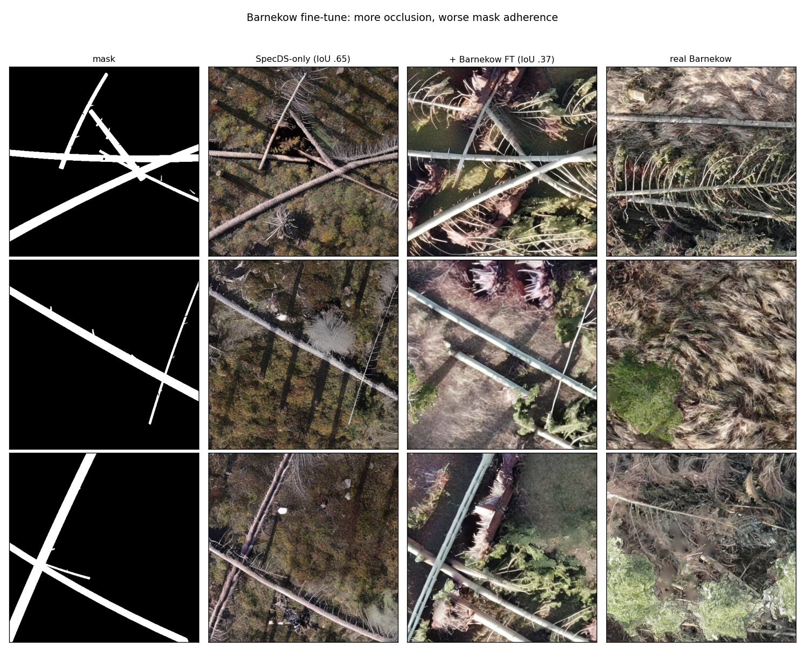
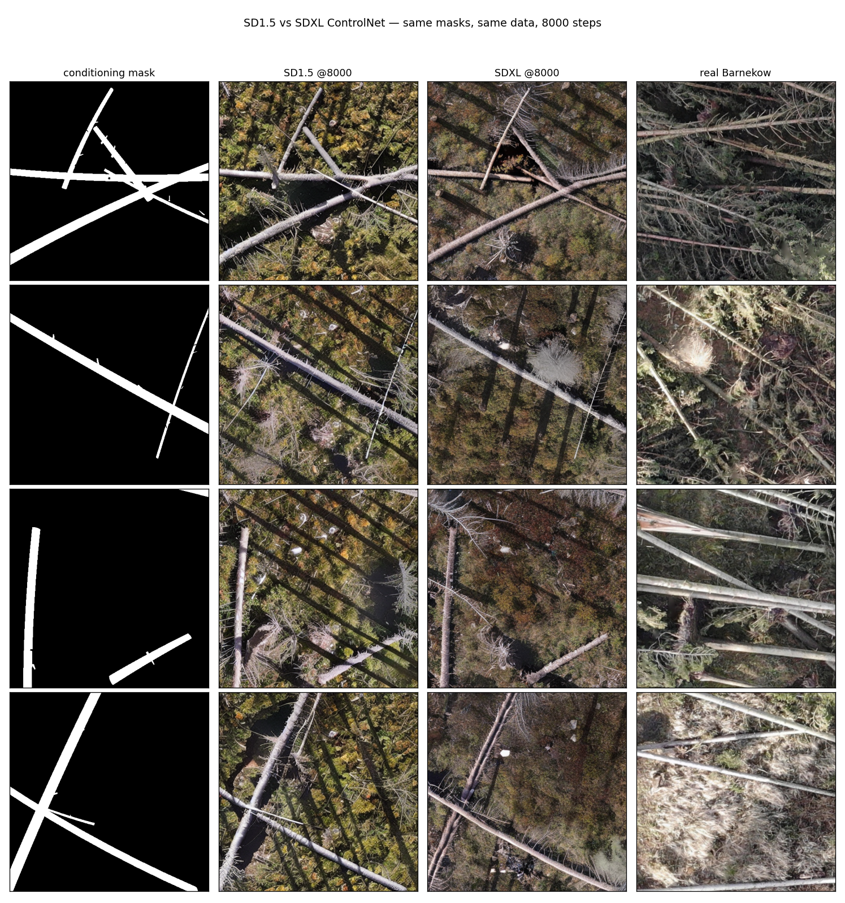
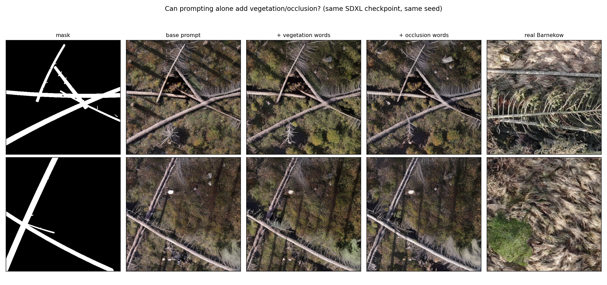
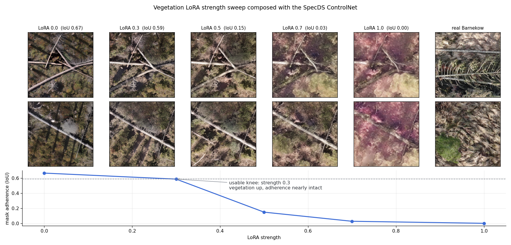
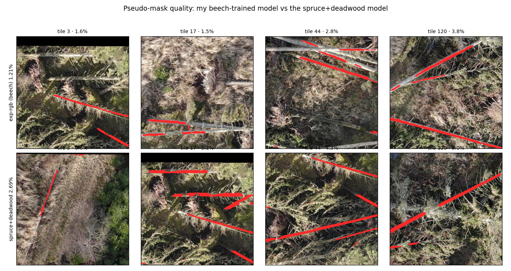
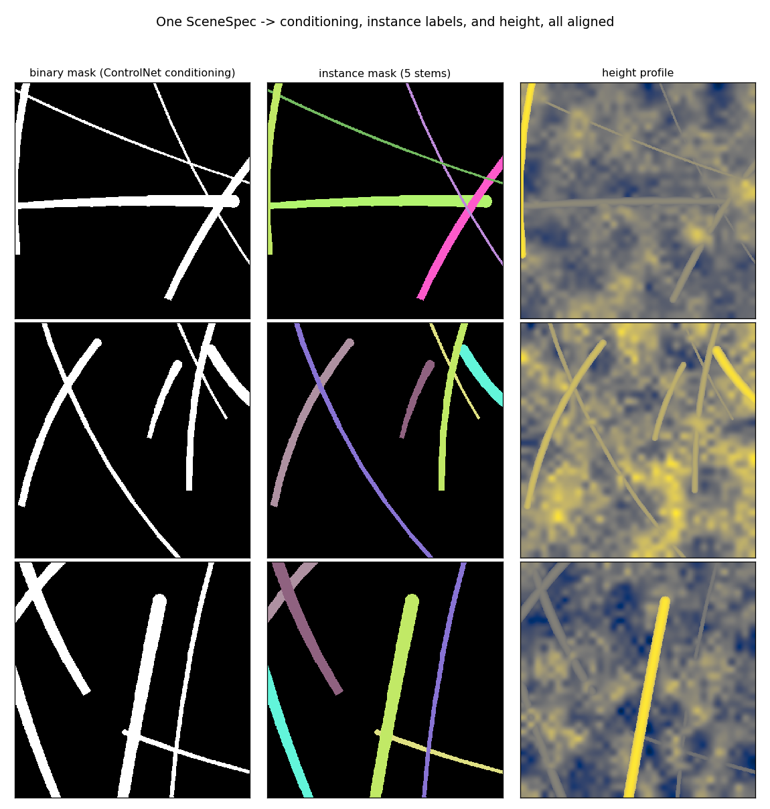
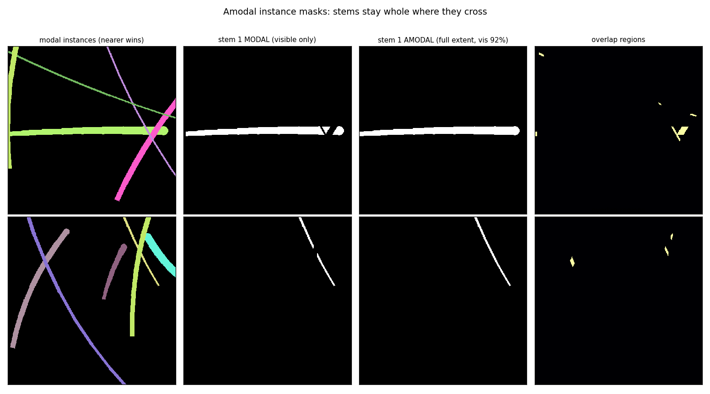
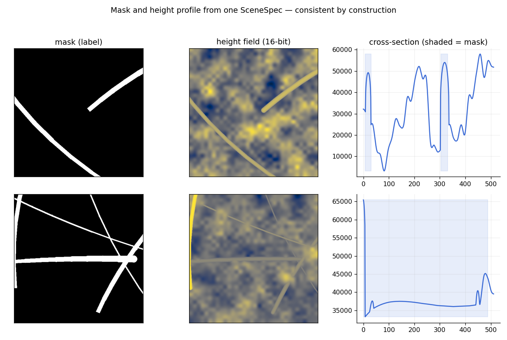

# Synthetic training data for stem segmentation — results

Status as of 2026-08-04. Branch `feat/synthetic-data-generation`.

## Headline

A segmenter trained on **nothing but generated imagery** reaches **F1 0.693** on the
real, hand-labelled beech TestDS — **94% of the 0.738 a segmenter trained on real
SpecDS achieves**, with zero manual annotation.

| training data | TestDS F1 | precision | recall |
|---|---|---|---|
| real SpecDS *(reference)* | 0.738 | 0.747 | 0.730 |
| **generated: SDXL ControlNet (arm A)** | **0.693** | 0.684 | 0.703 |
| generated: + vegetation LoRA @0.3 (arm B) | 0.661 | 0.628 | 0.698 |
| generated: Barnekow-fine-tuned ControlNet (arm C) | 0.195 | 0.775 | 0.112 |

All three arms use the *same* 1,200 conditioning masks and the same training recipe
(deeplabv3plus/resnet34, 30 epochs); only the generator differs.

## How it works

1. `synthgen/sampler.py` draws a seeded `SceneSpec` — stems with length, diameter,
   taper, bend, elevation, burial, plus ground, sun and clutter parameters.
2. `scripts/rasterize_masks.py` turns one spec into aligned labels: binary mask
   (the ControlNet conditioning), per-stem instance ids, amodal instance stack with
   visibility, and a 16-bit height field.
3. A **ControlNet** (SDXL, trained on 3,681 real SpecDS mask→tile pairs) paints a
   photorealistic tile from the binary mask.
4. The generated tile ships with all of those labels, exactly aligned.

## What the evidence says

### Label fidelity beats visual realism

Ordering by mask adherence predicts downstream F1; ordering by how real the tiles
*look* does not. Arm C is by far the most convincing to the eye and by far the worst
teacher — precision 0.775 with recall 0.112, the signature of a model taught that
stem-labelled pixels usually look like brash.

### SDXL beats SD1.5

Same data, same masks, 8,000 steps. SD1.5 peaked at 4,000 steps and regressed; SDXL
was still improving at 8,000.

| checkpoint | SD1.5 | SDXL |
|---|---|---|
| 4,000 | 0.364 | 0.264 |
| 8,000 | 0.335 | **0.387** |

*(measured with the beech-trained judge; see the caveat below)*

### Prompting cannot move appearance; data can

A ControlNet trained hard on one domain dominates the text prompt. Adding vegetation
or occlusion words changes almost nothing.

A vegetation LoRA does move it, and — unlike fine-tuning the ControlNet — leaves the
trade-off as a dial. Usable to ~0.3; beyond 0.5 the LoRA overwhelms the conditioning
and stems vanish entirely.

### Measure with the right instrument

Mask adherence was scored with a segmenter for several rounds before we noticed it
under-detects on this domain: on *real* Barnekow imagery the beech-trained model finds
0.8% stem coverage where the spruce+deadwood model finds 4.9%. Every adherence number
rose substantially once re-measured:

| | beech judge | spruce+deadwood judge |
|---|---|---|
| SD1.5 @8000 | 0.335 | 0.584 |
| SDXL @8000 | 0.388 | **0.647** |

The same lesson applied to pseudo-labelling the Barnekow orthomosaic: switching to the
spruce+deadwood model doubled recovered stem coverage (1.21% → 2.69%).

## Labels the real data cannot provide

One `SceneSpec` yields binary, modal-instance, amodal-instance and height labels that
are consistent by construction.

Amodal masks keep a stem whole where another crosses it — a modal label fragments it,
which is precisely what a downstream vectorizer must then undo.

The height field keeps the RGBD line alive on the generated path: stems sit ~12–14k of
65k levels above terrain with ~2.5k levels of surface modulation.

## Negative result: instance segmentation needs a box-free method

Mask R-CNN trained on the same tiles, scored on real TestDS by unioning instances:

| method | TestDS F1 |
|---|---|
| binary segmentation | **0.693** |
| modal instances (Mask R-CNN) | 0.079 |
| amodal instances (Mask R-CNN) | 0.085 |

Diagnosis, measured rather than assumed:

- **Not domain transfer** — on held-out *synthetic* tiles it scores 0.121, barely
  better than on real. It never learned the task.
- **Not NMS suppression** — median pairwise box IoU between stems is 0.001; only 2% of
  pairs exceed the 0.5 threshold.
- **It is box fill.** A stem occupies a median **12.9%** of its axis-aligned bounding
  box, and 57% of stems fill under 15%. The mask head must paint a thin diagonal ribbon
  inside a box that is ~87% background, so its confidence never exceeds 0.447 and its
  masks bleed into background (precision 0.04–0.07 at recall 0.53).

The labels are sound and the imagery is sound; the architecture is wrong for elongated
diagonal objects. Box-free formulations — per-pixel embedding clustering, oriented
boxes, or the centerline/orientation fields prototyped in #14 — are the way forward.

## Open items

- Scale arm A beyond 1,200 tiles to test whether the remaining 0.045 gap to real data closes.
- Test synthetic pretraining + real SpecDS fine-tune against real-only.
- Depth-conditioned ControlNet is **deferred**: monocular depth estimation on noisy
  orthomosaic tiles is not reliable enough to supply conditioning.
- The Blender path (`synthgen/render_bpy.py`) remains the only source where depth and
  image describe the same pixels; the generated path's depth describes the *specified*
  geometry, so generator-painted occlusion does not appear in it.
