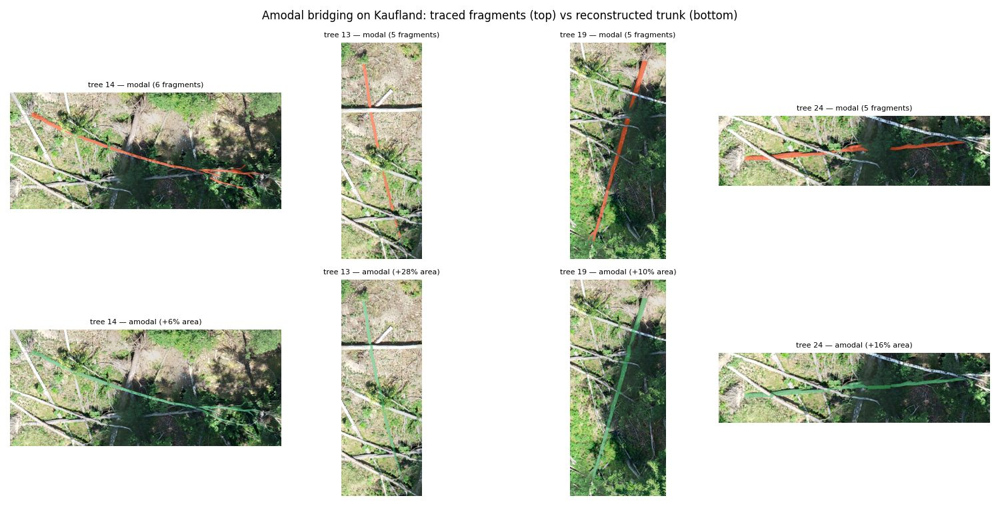

## Amodal stems: bridging the occlusion gaps

`--instance-level tree` gives the fragments of one stem a shared label, but the mask still
has holes where branches hid the trunk. `scripts/amodal_stems.py` reconstructs those spans,
producing one connected polygon per tree covering the trunk **including the parts the camera
never saw**.

```bash
python scripts/amodal_stems.py --stems <site>.shp --ortho <site>_ortho.tif \
  --out <site>_amodal.tif --instances <site>_amodal_inst.tif --report <site>.json
```

Fragments of one id are collinear by construction, so the axis is fitted by PCA over every
vertex, fragments are ordered along it, and consecutive pairs are joined by a segment
buffered to half the local stem width — interpolated across the gap, so a tapering trunk
stays tapered.

| site | fragments | trees | bridges | stem area | reconstructed | refused |
|---|---:|---:|---:|---:|---:|---:|
| Kaufland | 125 | 60 | 58 | 250 → 270 m² | +7.8% | 7 |
| Barnekow_5 | 1012 | 332 | 612 | 1826 → 1981 m² | +8.5% | 68 |
| Campus | 822 | 600 | 181 | 2908 → 3007 m² | +3.4% | 41 |

**The limits are derived, not guessed.** Across 941 real gaps the distribution is median
**0.67 m**, p90 3.95 m, p99 10.3 m, max 35.4 m. The defaults — 5 m absolute *and* 12 stem
widths, both of which must pass — bridge about 93% of gaps and refuse the tail.

An earlier 20 m default bridged **99.9%** of gaps including a 35 m span, longer than a whole
median stem. That reconstructed +15.5% / +13.8% / +6.5% of stem area, roughly double what
the conservative rule adds, and the difference was invention rather than reconstruction.
The relative limit matters independently of the absolute one: 5 m across a 0.15 m sapling
is a different proposition from 5 m across a 0.8 m trunk.



**Why this is a different learning target.** A model trained on modal masks learns "mark the
bark you can see". Trained on amodal masks it learns "mark where the trunk is" — which is
what a downstream vectorizer needs and currently has to infer for itself.

**What is refused, and why that matters.** A shared `id` is an assumption about the data, not
a guarantee. A bridge is declined when the gap exceeds `--max-gap` (default 20 m) or when it
would run more than `--max-offset` stem widths off the fitted axis. Refusals are counted in
the report rather than silently dropped: **17 of ~950 bridges were refused across the three
sites, 1.8%**, which is itself evidence that `id` really does mean one tree. A corpus where
that rate were high would be telling you the field means something else.

### Does training on amodal masks actually help?

HRNet + ImageNet encoder (the best configuration from the architecture sweep), trained
three times with identical settings and evaluated on the **same** images:

| | components | mean component length | longest | F1 |
|---|---:|---:|---:|---:|
| modal-trained | 2.62 | 264 px | 379 px | 0.7626 |
| amodal, permissive bridging | 2.66 | 277 px | 400 px | 0.7634 |
| **amodal, conservative bridging** | 2.70 | **276 px** | 395 px | 0.7570 |
| *amodal labels (ceiling)* | *2.30* | *300 px* | *396 px* | — |

**Amodal training yields +4.5% mean component length**, closing roughly a third of the gap
to the label ceiling (88% → 92% of label continuity).

The important line is the middle one. The first amodal run used a 20 m bridging limit that
reconstructed about twice as much area, much of it invented. Retraining on the conservative
labels gives **+4.5% against +4.9%** — statistically the same. So the benefit comes from
bridging *real* occlusions, and the invented spans contributed nothing. Had the numbers
diverged, the original result would have been an artefact of the labels rather than a
property of amodal training.

It costs about 0.6 points of F1 (0.7570 vs 0.7626), and the shape of that is informative:
precision falls (0.7518 vs 0.7765) while recall rises (0.7624 vs 0.7491). The amodal model
marks more stem, some of which the labels do not credit — which is the intended behaviour,
since it is predicting trunk that the camera could not see.

**F1 is not the comparison to make.** A modal-trained and an amodal-trained model are scored
against different labels and the modal target is strictly easier. Continuity is computed
from the prediction alone, so it is the only figure here that means the same thing for both.

**A metric that lied first.** The original measure counted skeleton endpoints, on the
reasoning that one unbroken stem contributes 2 and three fragments contribute 6. In
practice it was dominated by skeleton spurs off the ragged traced outlines — the reference
masks score ~33 endpoints per tile against a prediction's ~6, which measures outline
roughness, not breaks. It reported the amodal model as *worse* (6.35 vs 5.97) while the
predictions were visibly more continuous. Mean major-axis length of the connected
components measures the property directly and agrees with what the eye sees.

**F1 is not the comparison.** A modal-trained and an amodal-trained model are scored
against different labels; the modal target is strictly easier. On the shared amodal test
set the two are near-identical (0.7564 vs 0.7584), which is itself informative — the
amodal model gains its continuity without paying for it in accuracy.
