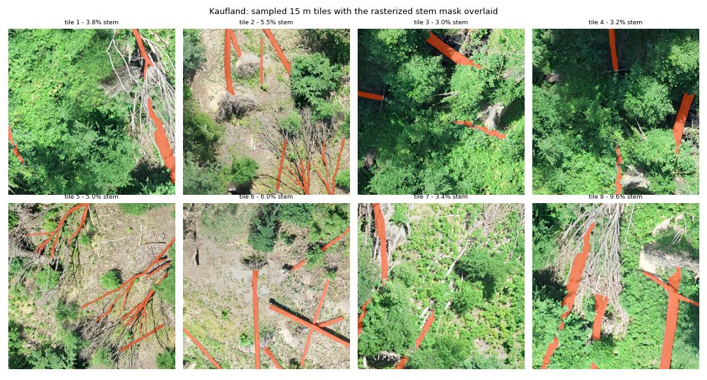

# Building training data from the WINMOL annotation corpus

How to turn `/…/Winmol/training_data` — orthomosaics plus hand-digitized stem
polygons — into the `train/train{N}.jpeg` + `mask/mask{N}.gif` pairs the loader
expects, and what is wrong with the corpus before you start.

## What is in the corpus

Run the inventory rather than trusting this section, which is a snapshot:

```bash
python scripts/inventory_training_data.py --root /path/to/Winmol/training_data \
  --md inventory.md --json inventory.json
```

As of August 2026 it reports **8 sites usable as training data**, carrying 3,844
polygons across 1,777 trees:

| site | polygons | trees | ortho | GSD |
|---|---:|---:|---:|---:|
| 20220212_Barnekow_5 | 1012 | 332 | 751 MP | 1.6 cm |
| 20171016_EW_WW_Campus | 822 | 600 | 147 MP | 6.4 cm |
| 20220212_Barnekow_6 | 743 | 260 | 870 MP | 1.7 cm |
| 20220226_EW_WW_Campus_Oberheide | 490 | 287 | 1911 MP | 3.4 cm |
| 20220212_Barnekow_3 | 358 | 108 | 297 MP | 1.8 cm |
| 20220209_Bremerhagen_3 | 158 | 60 | 376 MP | 1.7 cm |
| 20171114_EW_WW_Bachsee_north | 136 | 70 | 214 MP | 4.1 cm |
| 20210706_EW_WW_Kaufland | 125 | 60 | 125 MP | 2.1 cm |

A further **19 orthomosaics have no annotations** (all of Bremerhagen 1–8 except 3,
Barnekow 1/2/4, Kaltes Wasser, Ruheforst, Stromtrasse, Alt Madlitz, Bachsee south).
They are usable for inference and for unsupervised pretraining, not for supervised
training.

Three layers per site, in three directories under `WINMOL_Trainings_Data/GIS/`:

- `Training_Data/<site>.shp` — the stem polygons (the labels)
- `Polygone/<site>_AOE.shp` — the digitized windthrow area (**where labelling
  happened**; see below, this one is not optional)
- `Orthomosaics/{beech,pine,spruce}/<site>_ortho.tif` — the imagery

## What the polygons are

Traced stem outlines, not crowns and not bounding boxes. Measured on Barnekow_5:
median length 3.00 m, width 0.43 m, area 0.84 m², **aspect ratio 7.3**, 21 vertices.

The `id` attribute is a **tree** id, not a polygon key. Barnekow_5 has 1012 polygons
sharing only 332 distinct ids; polygons with the same id are collinear (measured
centroid collinearity 0.006) and spaced about 8.7 m apart. One windthrown stem was
digitized as several segments along its length, broken where branches or other
stems occlude it, and the id records which fragments belong to the same tree.

That is stem continuity across occlusion — what a downstream vectorizer normally
has to infer — already labelled by hand. `scripts/rasterize_annotations.py
--instance-level tree` preserves it; `--instance-level segment` gives each visible
fragment its own id instead.

## Sampling: why not a grid

Stems cover roughly **1% of a site**. A regular grid over an orthomosaic therefore
produces overwhelmingly empty tiles, and a model trained on it learns to predict
background.

The original R generator (kept verbatim at
`docs/reference/241202_Training_data_SpecDS.R`) avoided this, and
`scripts/sample_training_tiles.py` is its Python port. Both:

1. draw random points inside the **windthrow polygon**, never the whole ortho;
2. shrink that polygon inward by half the footprint diagonal, so a rotated footprint
   still lands entirely inside annotated ground (the R script's `-11` m for a 15 m
   square is 10.61 m rounded up);
3. cut a 15 m square at a **uniformly random rotation**;
4. **reject** the tile unless stems cover ≥ 0.5% of it (`SmplExtend^2/200`);
5. oversample by 100×, so tiles overlap and each stem is seen at many offsets and
   angles.

Step 1 is the one that is easy to skip and expensive to skip. Outside the digitized
area the stems are still there but were never traced, so tiles sampled from there
teach the model that plainly visible stems are background.

Step 3 is why the R-trained model saw rotated stems without any rotation
augmentation in the training loop. If you sample with `--no-rotate`, turn
`--aug-rotate-p` up to compensate.

Step 4 is what does the work: on Kaufland it lifts mean stem coverage from the
site-wide ~1% to **6.2%** per tile.

```bash
GIS=/path/to/Winmol/training_data/WINMOL_Trainings_Data/GIS
python scripts/sample_training_tiles.py \
  --ortho $GIS/Orthomosaics/beech/20210706_EW_WW_Kaufland_ortho.tif \
  --stems $GIS/Training_Data/20210706_EW_WW_Kaufland.shp \
  --aoi   $GIS/Polygone/20210706_EW_WW_Kaufland_AOE.shp \
  --out   datasets/kaufland
```

To pool several sites into one dataset, pass `--start-index` the previous site's
reported `next_index` so the integer keys do not collide.

Needs the geo extra: `pip install -e ".[geo]"` (rasterio, fiona, shapely, pillow).
It is deliberately separate from `[train]` — nothing on the training or ONNX-serving
path should pull GDAL.

## Resolution is not uniform, and tiling hides it

Every tile is resampled to 512 px, so a 15 m footprint is always 2.93 cm/px. The
corpus spans 1.2–6.4 cm/px, so that same command **downsamples Barnekow by 1.9×
and upsamples Campus by 2.2×** — the Campus tiles contain interpolated detail that
was never imaged. The script prints the factor per site. Either accept it as
scale augmentation, or set `--extent` per site to hold the resampling near 1.0
(Campus wants roughly `--extent 33`).

## Tracing a tile back to the ground

Every dataset carries a `tiles.jsonl` recording, per tile, the source orthomosaic, the
world centre, the rotation, the ground resolution and the stem fraction. Without it a
suspicious label cannot be checked, because a tile index says nothing about where it came
from.

```bash
python scripts/locate_tile.py --data-dir <DS>/test --tile 182 --crop audit.png
```

`--crop` re-cuts the same footprint from the source orthomosaic at **native** resolution.
That is usually the view that settles a label question: a Campus training tile is
upsampled 3.2× from 6.4 cm imagery and has no detail left to judge by, while the native
crop does.

## Leak-free splits

Split by **site**, never by tile. With 100× oversampling adjacent tiles overlap
heavily, so a random tile split puts near-duplicates of the same stems on both
sides and reports a validation score that is mostly memorization. Generate each
site into its own directory and assign whole sites to train / val / test.

Barnekow_3, _5 and _6 are three areas of one estate; treat them as one unit when
assigning splits rather than spreading them across train and test.

## Defects to handle

- **Mixed CRS.** Campus and Bachsee north/south are EPSG:32633, everything else is
  EPSG:25833 — the same UTM zone on different datums, so a silent mismatch shifts
  masks by metres instead of failing. `20171114_EW_WW_Bachsee_north` has its
  annotations in 25833 and its ortho in 32633. Both scripts reproject explicitly.
- **`202171114_EW_WW_Bachsee_north`** is a typo'd duplicate of the 2017**1**114
  site, with no matching ortho. Ignore it; do not "fix" the name and pair it, as
  the 136 polygons are the same ones.
- **Species case variants.** `RBU`/`rBU`/`RBu`, `GFI`/`GFi`/`gFI`, `DGL`/`DGl`/`dGL`,
  `RGU`/`rGU`, plus single-record typos `GIF` and `GFIU`. Match case-insensitively
  (both scripts do) or you silently drop records. 337 stem polygons have no species
  at all. Overall: GFI 1986, RBU 1289+, GKI 237, DGL 95, GBI 11, RGU 2.
- **No DEMs anywhere in the corpus.** The inventory finds 0 DEM/DSM/CHM rasters, so
  the RGBD arm cannot be run on this data as delivered — it needs the photogrammetric
  height models exported alongside these orthomosaics, or the synthetic depth
  simulator as a stand-in.
- **`Revier_12`/`Revier_13` GeoJSON** under `WINDWURF_Tegel/` (450 files, 24k
  features) is WINMOL Analyzer *output* — detected stems, nodes and vectors — not
  ground truth. Useful for evaluating the analyzer end to end; not labels.
- **`ALS segmentation 2017`** (538k polygons) is an airborne-laser crown
  segmentation with no ortho and no stem semantics. Not training data.

## Verify before training

Overlay masks on imagery for a handful of tiles and look at them. Georeferencing
bugs are silent — a mask offset by a metre still trains, just badly.



Sixteen tiles sampled from Kaufland, eight shown, mask in orange. Each tile is a
different random position and rotation; the masks sit on the stems, which is what
confirms the reprojection, the rotation and the window transform together.
